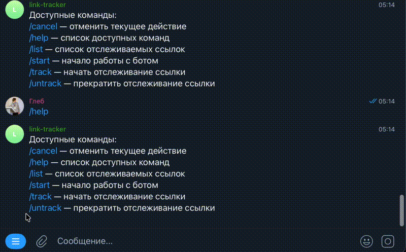

# LinkTracker

**LinkTracker** - Telegram-бот, который отслеживает изменения на веб-страницах 
(сервис работает со страницами stackoverflow и github) и оперативно информирует пользователя о них.

## Запуск

Сначала скопируйте шаблоны переменных окружения и заполните `APP_TELEGRAM_TOKEN`
(при необходимости - `APP_GITHUB_TOKEN` и `APP_STACKOVERFLOW_KEY`, они увеличивают лимиты запросов к API):

```bash
cp env.bot.dist .env.bot
cp env.scrapper.dist .env.scrapper
```

Дальше есть два способа запуска.

### Вариант 1. сервисы на хосте + Postgres в Docker

```bash
docker compose up -d postgres
make migrate-up
make build
./bin/scrapper
./bin/bot
```

### Вариант 2. Docker Compose

```bash
make compose-up
```

## Тестирование

### юнит-тесты

Для запуска юнит-тестов выполните команду:

   ```bash
   make test
   ```

### интеграционные тесты

Для запуска интеграционных тестов выполните команду:

   ```bash
   make integration-test
   ```

## Выбор протокола связи (HTTP / gRPC)

Переключение протокола общения между `scrapper` и `bot`:
В файлах `.env.bot` и `.env.scrapper` измените переменную `APP_TRANSPORT`:
- `APP_TRANSPORT=http` (используется REST/JSON по HTTP)
- `APP_TRANSPORT=grpc` (используется gRPC)


## Демонстрация работы



